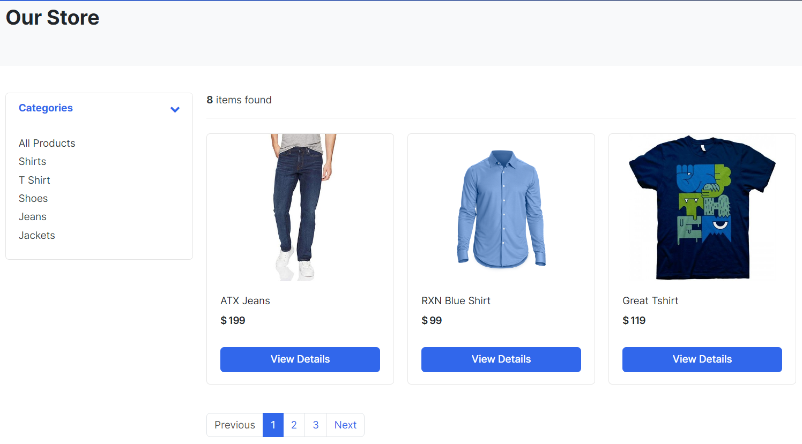

# Greatcart Web Application

This scalable ecommerce web app is built on the robust combination of Python, Django, and PostgreSQL. Leveraging Python's versatility, we ensure seamless integration of diverse functionalities while maintaining code readability. Django, a high-level web framework, enables rapid development with its built-in features like authentication, session management, and templating. PostgreSQL, a powerful open-source database, ensures data integrity, scalability, and robustness.

This app employs efficient indexing and query optimization techniques for lightning-fast data retrieval. With a modular architecture, this app easily accommodates future expansion and integrates with third-party services. The emphasis on scalability guarantees a seamless user experience even under high traffic. Offering secure payment gateways, user-friendly interfaces, and efficient order management, our ecommerce web app built on Python, Django, and PostgreSQL is tailored to elevate your online business.

## Views

  

  

## Setup

- Clone the project run: `git clone git@github.com:rOluochKe/greatcart.git`
- Change directory into run: `cd greatcart`
- Create your environment and install dependencies run: `pip install -r requirements.txt`
- Create admin user run: `python manage.py createsuperuser`
- Run app: `python manage.py runserver`
